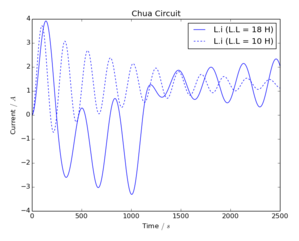
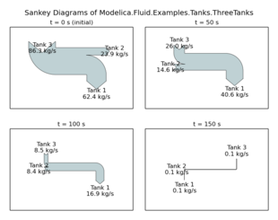

ModelicaRes
-----------

[ModelicaRes] is a free, open-source tool to manage [Modelica] simulations,
interpret results, and create publishable figures.  It is possible to

- Auto-generate simulation scripts,
- Browse data,
- Perform custom calculations, and
- Produce various plots and diagrams.

The figures are generated via [matplotlib], which
offers a rich set of plotting routines.  [ModelicaRes] includes convenient
functions to automatically pre-format and label some figures, like xy plots,
Bode and Nyquist plots, and Sankey diagrams.  [ModelicaRes] can be scripted or
run from a [Python] interpreter with math and matrix functions from [NumPy].

For more information, please see the [main project site] or the [doc](doc)
folder for the full documentation and many examples.

### Installation

The easiest way to install this package is to use 
[pip](https://pypi.python.org/pypi/pip):

    pip install modelicares

On Linux, it may be necessary to have root privileges:

    sudo pip install modelicares

Another way is to download and extract a copy of the package from the 
[main project site], the 
[master branch at GitHub](https://github.com/kdavies4/ModelicaRes), or the
[PyPI page](http://pypi.python.org/pypi/ModelicaRes).  Run the following command 
from the base folder:

    python setup.py install

Or, on Linux:

    sudo python setup.py install

The [matplotlibrc](matplotlibrc) file has some recommended revisions to
[matplotlib]'s defaults.  To use it, move or copy it to the working directory or 
[matplotlib]'s configuration directory.  See
http://matplotlib.org/users/customizing.html for details.

### Credits

The main author is Kevin Davies.  Improvements, bug fixes, and suggestions have 
been provided by Arnout Aertgeerts, Kevin Bandy, Thomas Beutlich, 
Martin Sjölund, Mike Tiller, and Michael Wetter.

Third-party code has been included from:

- Jason Grout
  ([ArrowLine](http://old.nabble.com/Arrows-using-Line2D-and-shortening-lines-td19104579.html)
  class),
- Jason Heeris
  ([efficient base-10 logarithm](http://www.mail-archive.com/matplotlib-users@lists.sourceforge.net/msg14433.html)),
- Richard Murray
  ([python-control](http://sourceforge.net/apps/mediawiki/python-control)), and
- Joerg Raedler (method to expand a [Modelica] variable tree---from [DyMat])

### License terms and development

[ModelicaRes] is published under a [BSD license](LICENSE.txt).  Please share any 
modifications you make (preferably on a Github fork from 
https://github.com/kdavies4/ModelicaRes) in order to help others.  If you find a 
bug, please
[report it](https://github.com/kdavies4/ModelicaRes/issues/new).  If you have
suggestions, please
[share them](https://github.com/kdavies4/ModelicaRes/wiki/Suggestions).

### See also

The following [Python] projects are related:

- [awesim]\: helps run simulation experiments and organize results
- [BuildingsPy]\: supports unit testing
- [DyMat]\: exports [Modelica] simulation data to comma-separated values (CSV),
  [Gnuplot](http://www.gnuplot.info/), MATLAB&reg;, and
  [Network Common Data Form (netCDF)](http://www.unidata.ucar.edu/software/netcdf/)
- [PyFMI]\: tools to work with models through the Functional Mock-Up Interface
  (FMI) standard
- [PySimulator]\: elaborate GUI; supports the FMI

[main project site]: http://kdavies4.github.io/ModelicaRes/
[ModelicaRes]: http://kdavies4.github.io/ModelicaRes/
[Modelica]: http://www.modelica.org
[Python]: http://www.python.org
[NumPy]: http://numpy.scipy.org
[matplotlib]: http://www.matplotlib.org
[awesim]: https://github.com/saroele/awesim
[BuildingsPy]: http://simulationresearch.lbl.gov/modelica/buildingspy/
[DyMat]: http://www.j-raedler.de/projects/dymat/
[PyFMI]: https://pypi.python.org/pypi/PyFMI
[PySimulator]: https://github.com/PySimulator/PySimulator
