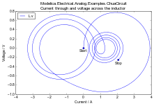
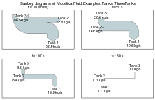

ModelicaRes
-----------

**Set up and analyze Modelica simulations in Python**

ModelicaRes is a free, open-source tool that can be used to
- generate simulation scripts,
- load and browse data,
- perform custom calculations,
- filter and sort groups of results,
- produce various plots and diagrams, and
- export data to various formats via [pandas].

The figures are generated via [matplotlib], which offers a rich set of
publication-quality plotting routines.  ModelicaRes has methods to create and
automatically label [xy plots], [Bode] and [Nyquist] plots, and
[Sankey diagrams].  ModelicaRes can be scripted or used in an interactive
[Python] session with math and matrix functions from [NumPy].

Currently, ModelicaRes only loads Dymola/[OpenModelica]-formatted results
(*.mat), but the loading functions are modular so that other formats can be
added easily.

Please see the tutorial, which is available as an
[IPython notebook](examples/tutorial.ipynb) or online as a
[static page](http://nbviewer.ipython.org/github/kdavies4/ModelicaRes/blob/master/examples/tutorial.ipynb).  For the full documentation and many more examples,
see the [main website].

### Installation

The easiest way to install this package is to use [pip]:

    pip install modelicares

On Linux, it may be necessary to have root privileges:

    sudo pip install modelicares

Another way is to download and extract a copy of the package.  The [main
website], the [GitHub repository], and the [PyPI page] have copies which
include the source code as well as examples and supporting files to build the
documentation and run tests.  Once you have a copy, run the following command
from the base folder:

    python setup.py install

Or, on Linux:

    sudo python setup.py install

Some of the required packages may not install automatically.
- [SciPy] can be installed according to the instructions at
  http://www.scipy.org/install.html.
- The GUIs require [Qt], which can be installed via [PyQt4], [guidata], or
  [PySide].

The [matplotlibrc file](examples/matplotlibrc) has some recommended revisions to
[matplotlib]'s defaults.  To use it, copy it to the working directory or
[matplotlib]'s configuration directory.  See
http://matplotlib.org/users/customizing.html for details.

### License terms and development

ModelicaRes is published under a [BSD-compatible license](LICENSE.txt).  Please
share any modifications you make (preferably as a pull request to the ``master``
branch of the [GitHub repository]) in order to help others.  There are useful
development scripts in the [hooks folder](hooks).  If you find a bug, please
[report it](https://github.com/kdavies4/ModelicaRes/issues/new).  If you have
suggestions, please
[share them](https://github.com/kdavies4/ModelicaRes/wiki/Suggestions).

### See also

- [awesim]\: helps run simulation experiments and organize results
- [BuildingsPy]\: supports unit testing
- [DyMat]\: exports [Modelica] simulation data to comma-separated values ([CSV]),
  [Gnuplot], MATLAB&reg;, and Network Common Data Form ([netCDF])
- [PyFMI]\: tools to work with models through the Functional Mock-Up Interface
  ([FMI]) standard
- [PySimulator]\: elaborate GUI; supports [FMI]

[main website]: http://kdavies4.github.io/ModelicaRes
[PyPI page]: http://pypi.python.org/pypi/ModelicaRes
[GitHub repository]: https://github.com/kdavies4/ModelicaRes
[xy plots]: http://kdavies4.github.io/ModelicaRes/simres.html#modelicares.simres.SimRes.plot
[Bode]: http://kdavies4.github.io/ModelicaRes/linres.html#modelicares.linres.LinRes.bode
[Nyquist]: http://kdavies4.github.io/ModelicaRes/linres.html#modelicares.linres.LinRes.nyquist
[Sankey diagrams]: http://kdavies4.github.io/ModelicaRes/simres.html#modelicares.simres.SimRes.sankey

[Modelica]: http://www.modelica.org/
[Python]: http://www.python.org/
[pandas]: http://pandas.pydata.org/
[matplotlib]: http://www.matplotlib.org
[NumPy]: http://numpy.scipy.org/
[SciPy]: http://www.scipy.org/index.html
[OpenModelica]: https://www.openmodelica.org/
[Qt]: http://qt-project.org/
[PyQt4]: http://www.riverbankcomputing.co.uk/software/pyqt/
[guidata]: https://code.google.com/p/guidata/
[PySide]: http://qt-project.org/wiki/pyside
[pip]: https://pypi.python.org/pypi/pip
[awesim]: https://github.com/saroele/awesim
[BuildingsPy]: http://simulationresearch.lbl.gov/modelica/buildingspy
[DyMat]: http://www.j-raedler.de/projects/dymat
[PyFMI]: https://pypi.python.org/pypi/PyFMI
[PySimulator]: https://github.com/PySimulator/PySimulator
[Gnuplot]: http://www.gnuplot.info/
[CSV]: http://en.wikipedia.org/wiki/Comma-separated_values
[netCDF]: http://www.unidata.ucar.edu/software/netcdf
[FMI]: https://www.fmi-standard.org/
[python-control]: http://sourceforge.net/apps/mediawiki/python-control
[ArrowLine]: http://old.nabble.com/Arrows-using-Line2D-and-shortening-lines-td19104579.html
[efficient base-10 logarithm]: http://www.mail-archive.com/matplotlib-users@lists.sourceforge.net/msg14433.html
