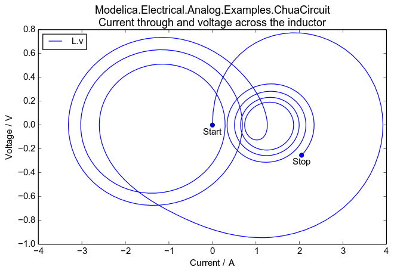
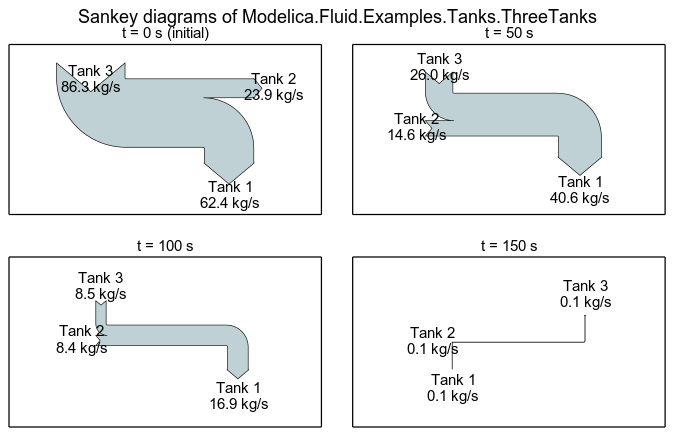

###############
  ModelicaRes
###############

**Python utilities to set up and analyze Modelica simulation experiments**

ModelicaRes is a free, open-source tool to manage Modelica_ simulations,
interpret results, and create publishable figures.  It can be used to

- generate simulation scripts,
- load and browse data,
- perform custom calculations,
- filter and sort groups of results,
- produce various plots and diagrams, and
- export data to various formats via pandas_.

The figures are generated via matplotlib_, which offers a rich set of plotting
routines.  ModelicaRes has methods to automatically create and label xy plots,
Bode and Nyquist plots, and Sankey diagrams.  ModelicaRes can be scripted or
used in an interactive Python_ session with math and matrix functions from
NumPy_.

.. image:: _static/browse.png
   :scale: 30 %
   :alt: Variable browser

.. image:: _static/PIDs-bode.png
   :scale: 30 %
   :alt: Bode plot of PID with varying differential time constant

Currently, ModelicaRes only loads Dymola/OpenModelica_-formatted results
(\*.mat), but the loading functions are modular so that other formats can be
added easily.

Please see the tutorial, which is available as an `IPython notebook
<https://github.com/kdavies4/ModelicaRes/blob/release/examples/tutorial.ipynb>`_
or online as a `static page
<http://nbviewer.ipython.org/github/kdavies4/ModelicaRes/blob/release/examples/tutorial.ipynb>`_.
The links in the sidebar provide the full documentation and many more examples.

The `loadres script <loadres.html>`_ helps to load simulation and linearization
results from the command line.  The top-level module, :mod:`modelicares`,
provides direct access to the most important classes and functions.  Others must
be accessed through their submodules.  The :mod:`~modelicares.simres` submodule
has classes to load, analyze, and plot simulation results.  The
:mod:`~modelicares.linres` submodule has a class to load, analyze, and plot
results from linearizing model(s).  The :mod:`~modelicares.exps` submodule has
tools to set up and manage simulation experiments.  The
:mod:`~modelicares.texunit` submodule has functions to translate Modelica_
*unit* and *displayUnit* strings into LaTeX_-formatted strings.  The last
submodule, :mod:`~modelicares.util`, has supporting functions and classes.

For a list of changes, please see the `change log <changelog.html>`_.

**Installation**

The easiest way to install ModelicaRes is to use pip_::

    pip install modelicares

On Linux, it may be necessary to have root privileges::

    sudo pip install modelicares

Another way is to download and extract a copy of the package from the sidebar on
the right.  Run the following command from the base folder::

    python setup.py install

Or, on Linux::

    sudo python setup.py install

Some of the required packages may not install automatically.

- SciPy_ can be installed according to the instructions at
  http://www.scipy.org/install.html.
- The GUIs require Qt_, which can be installed via PyQt4_, guidata_, or PySide_.

The `matplotlibrc file
<https://github.com/kdavies4/ModelicaRes/blob/release/matplotlibrc>`_ has some
recommended revisions to matplotlib_'s defaults.  To use it, copy it to the
working directory or matplotlib_'s configuration directory.  See
http://matplotlib.org/users/customizing.html for details.

**License terms and development**

ModelicaRes is published under a `BSD-compatible license <license.html>`_.  The
development site is https://github.com/kdavies4/ModelicaRes.  Please share any
modifications you make (preferably as a pull request to the ``master`` branch at
that site) in order to help others.  If you find a bug, please `report it
<https://github.com/kdavies4/ModelicaRes/issues/new>`_.  If you have
suggestions, please `share them
<https://github.com/kdavies4/ModelicaRes/wiki/Suggestions>`_.

**See also**

- awesim_: helps run simulation experiments and organize results
- BuildingsPy_: supports unit testing
- DyMat_: exports Modelica_ simulation data to comma-separated values
  (CSV_), Gnuplot_, MATLAB®, and Network Common Data Form (netCDF_)
- PyFMI_: tools to work with models through the Functional Mock-Up Interface
  (FMI_) standard
- PySimulator_: elaborate GUI; supports FMI_

.. toctree::
  :hidden:

  credits
  Tutorial <http://nbviewer.ipython.org/github/kdavies4/ModelicaRes/blob/master/examples/tutorial.ipynb>
  Advanced topics <http://nbviewer.ipython.org/github/kdavies4/ModelicaRes/blob/master/examples/advanced.ipynb>
  loadres
  modelicares
  simres
  linres
  exps
  texunit
  util

.. _main website: http://kdavies4.github.io/ModelicaRes/
.. _PyPI page: http://pypi.python.org/pypi/ModelicaRes/

.. _Modelica: http://www.modelica.org
.. _Python: http://www.python.org
.. _pandas: http://pandas.pydata.org
.. _matplotlib: http://www.matplotlib.org
.. _NumPy: http://numpy.scipy.org
.. _SciPy: http://www.scipy.org/index.html
.. _OpenModelica: https://www.openmodelica.org/
.. _Qt: http://qt-project.org/
.. _PyQt4: http://www.riverbankcomputing.co.uk/software/pyqt/
.. _guidata: https://code.google.com/p/guidata/
.. _PySide: http://qt-project.org/wiki/pyside
.. _wxPython: http://www.wxpython.org
.. _pip: https://pypi.python.org/pypi/pip
.. _LaTeX: http://www.latex-project.org
.. _awesim: https://github.com/saroele/awesim
.. _BuildingsPy: http://simulationresearch.lbl.gov/modelica/buildingspy
.. _DyMat: http://www.j-raedler.de/projects/dymat
.. _PyFMI: https://pypi.python.org/pypi/PyFMI
.. _PySimulator: https://github.com/PySimulator/PySimulator
.. _Gnuplot: http://www.gnuplot.info
.. _CSV: http://en.wikipedia.org/wiki/Comma-separated_values
.. _netCDF: http://www.unidata.ucar.edu/software/netcdf
.. _FMI: https://www.fmi-standard.org
